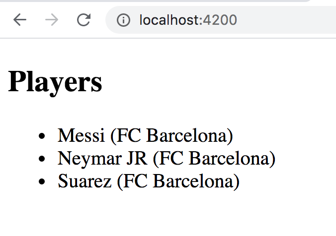
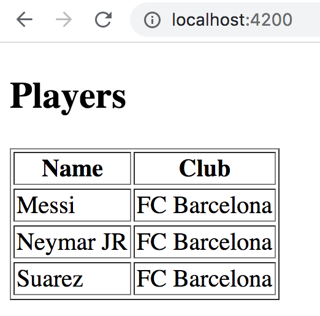
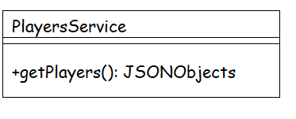
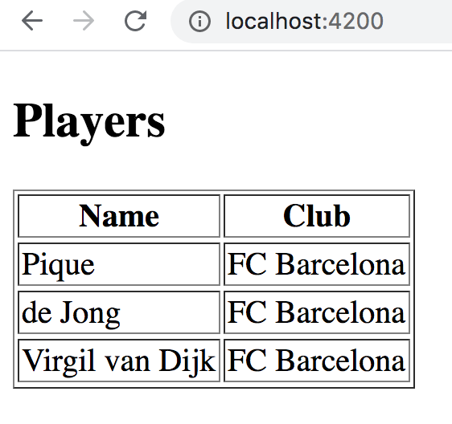
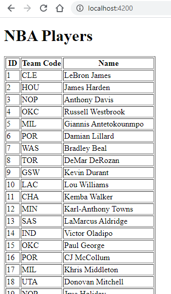

# Angular Exercise 3 – Introduction Continued

> Complete ALL the exercises in this section. Ask thomas.devine@atu.ie for help.

<!-- ## Contents -->


## Part 1 - Creating a Component (using CLI)

1.  View the video **7 - Create Component using CLI** and create the `PlayersComponent` as shown.  Use the following HTML in the template `players.component.html`

    ```html
    <h2>Players</h2>
    <div>Messi</div>
    <div>Neymar JR</div>
    <div>Messi</div>
    ```

View the component at [http://localhost:4200](http://localhost:4200)


## Part 2 - ngFor Directive

1.  In the `PlayersComponent` create a `players` array:

    ```typescript
    players = ["Messi", "NeymarJR", "Suarez"];

    ```

    and modify the template `players.component.html` to render these players using interpolation and the `ngFor` directive.  Display the players using `<div>` elements.

1.  Modify the code above to display the player names using bullet points within an unordered list (`<ul>`).

1.  Modify the `players` array to store JSON objects for the same players:

    ```typescript
    players = [{"name":"Messi", "club": "FC Barcelona"}, {"name":"Neymar JR", "club": "FC Barcelona"}, {"name":"Suarez", "club": "FC Barcelona"}];

    ```

    and then have the `PlayersComponent` render this:

    

1.  Finally, for now modify the `PlayersComponent` to render this table:

    


## Part 3 - Services with Dependency Injection

1.  View the videos **10 - Services** and **11 - Dependency Injection**.  Then create a service called `PlayersService` that uses *Dependency Injection* with the following structure:

    

    In the `getPlayers()` method return this new array of JSON objects:
    
    ```typescript
    [ {"name":"Pique", "club": "FC Barcelona"}, {"name":"de Jong", "club": "FC Barcelona"}, {"name":"Virgil van Dijk", "club": "FC Barcelona"} ]
    
    ```

    Your solution should then render:

    
    

## Part 4 - NBAPlayers Component 

1.  Create a new Component `NbaPlayersComponent` that will render the output shown below:

    

    from the JSON content in [this](assets/NBAPlayers.json) JSON file.

    Create and use a service `NbaPlayersService` to provide the player data needed by the component.

    
