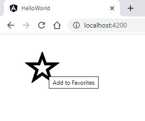
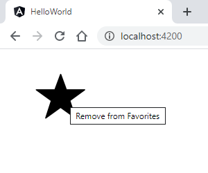

# Angular Exercise 4 – Displaying Data & Event Handling

> Complete ALL the exercises in this section. Ask thomas.devine@atu.ie for help.

<!-- ## Contents -->

## Part 1 - Displaying Data & Event Handling

1.  View the video for this exercise on BlackBoard that shows 4 separate components being used.

1.  Create and test each component:

    - `LikeButtonComponent`
    - `CountDownComponent`
    - `AddComponent`
    - `FruitSelectComponent`

## Part 2 - Favourite Component

1.  Create a new component called `FavouriteComponent` that when rendered shows this image:

    

    Also notice the tooltip that appears when the mouse hovers over the image.

    When a user clicks the image it should change to this:

    

    The image shown should also toggle when clicked each time.

    Two images are need for this component - [star.png](images/star.png) and [star-empty.png](images/star-empty.png).  You should store them in the `assets` folder.

    