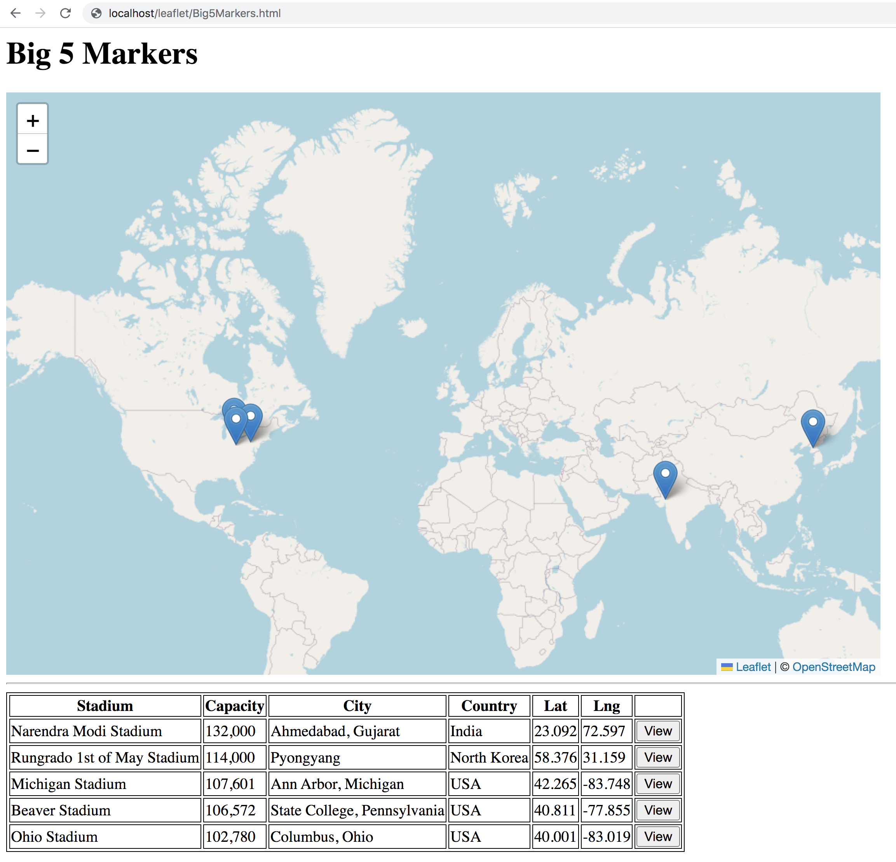
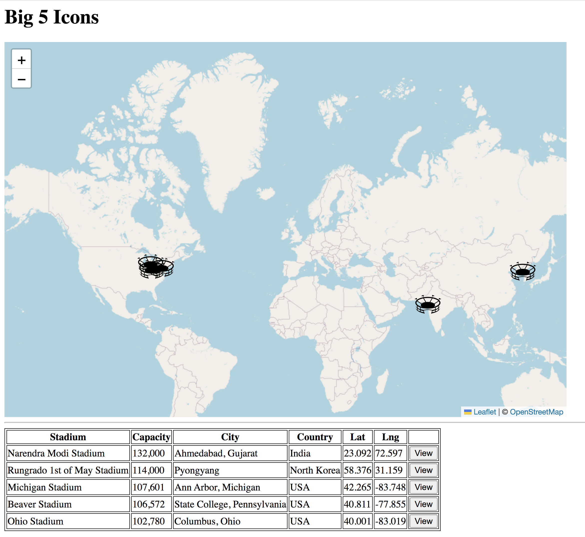
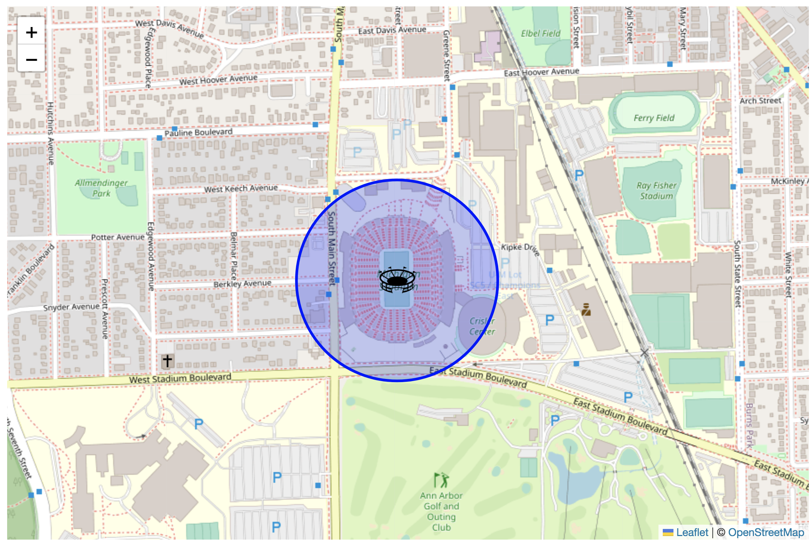

# Leaflet Exercise 2

<!-- ## Clone the Remote Repository

This will copy some ``leaflet`` code files to your ``htdocs`` folder.  

Go to [this link](https://github.com/barcaxi/wfd2023) and download the repository ZIP file.  Copy the folder ``leaflet`` into your XAMPP ``htdocs`` folder.

Check your ``htdocs`` folder.  You should have a new folder called ``leaflet`` with some files in it. -->

## Big 5 Markers

1.	Update your code file [http://localhost/leaflet/Big5.html](http://localhost/leaflet/Big5.html) to show a marker for each stadium as shown here:

	

	Consider storing the stadium locations in an array.  Keep the `.js` and `.html` code separate!

## Big 5 Icons

1.	Update your code file [http://localhost/leaflet/Big5.html](http://localhost/leaflet/Big5.html) to show a [icon](images/stadium.png) marker for each stadium as shown here:

	

## Big 5 Circles

1.	Update your code file [http://localhost/leaflet/Big5.html](http://localhost/leaflet/Big5.html) to show a 200 metre circle around each stadium as shown here:

	

	
## Big 5 Popups

1.	Update your code file [http://localhost/leaflet/Big5.html](http://localhost/leaflet/Big5.html) to show a popup with the stadium name when clicked as shown [here](images/Big5Popups.gif)

## Big 5 Events

1.	Update your code file [http://localhost/leaflet/Big5.html](http://localhost/leaflet/Big5.html) to show a popup with capacity information when the stadium circle is clicked as shown [here](images/Big5Events.gif)

	

